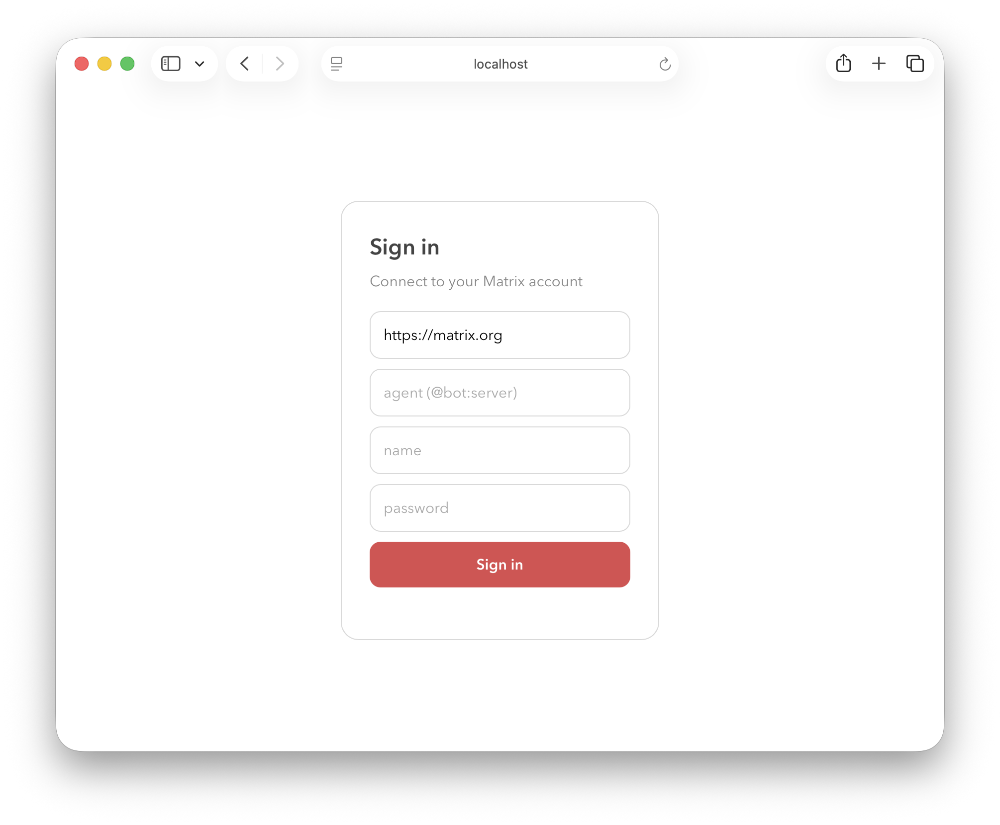
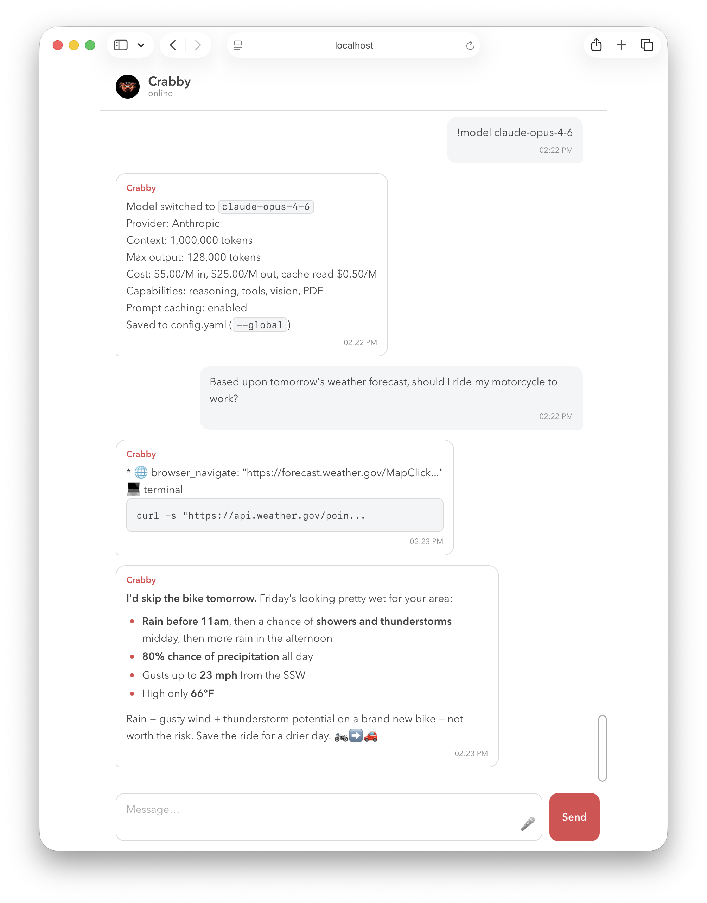

# Bare Agent


A tiny, themeable, single-pane web UI for chatting with a **Matrix-connected AI
agent** (or any Matrix user). No multi-room IM app, no clutter — just you and
your agent, styled how you like.

It's a static site: a little HTML/CSS/JS that talks directly to a Matrix
homeserver via [`matrix-js-sdk`](https://github.com/matrix-org/matrix-js-sdk).
Deploy it anywhere that serves static files (Cloudflare Pages, Netlify, GitHub
Pages, your own web server, …).



## Agent-agnostic

Matrix has no built-in "this user is an AI" flag — an agent is just a regular
Matrix user. So you simply tell Bare Agent **which Matrix ID your agent is**
(on the login screen), and it talks to that user. That means it works with
**any** Matrix-connected agent — [Hermes](https://github.com/NousResearch/hermes-agent),
OpenClaw, a custom bot, anything — with no special-casing. The only requirement
is that your agent replies in **unencrypted** rooms (see Security).

## Features

- Single-pane chat with one agent
- Works with any Matrix-connected agent — you point it at the agent's Matrix ID
- Renders the agent's formatted (Markdown/HTML) messages — headings, lists,
  code, blockquotes, tables
- **Voice notes** — record, review, and send audio; plays back voice notes from
  you or the agent, and interops with Element ([see below](#voice-notes))
- Shows the agent's Matrix avatar (or its initial) in the header
- Resumes your last conversation on any browser/device (finds the room
  server-side, not just via local storage)
- Infinite scroll-up (back-pagination) through history
- Log in to **any** homeserver from the login screen
- One-line theming via a single `--accent` color
- No build-time secrets — you log in at runtime



## Prerequisites

- A **Matrix-connected agent to chat with** (e.g. a Hermes or OpenClaw bot) that
  replies in **unencrypted** rooms — you'll enter its Matrix ID at login
- A **Matrix account** to log in as
- A place to host a single, static web page (for simiplicity)


## Quick start

```bash
git clone <your-repo-url> bare-agent
cd bare-agent
npm install
npm run dev      # local dev server
```

Open the printed URL, then on the login screen enter your **homeserver**, your
agent's **Matrix ID** (`@bot:server`), and your **username + password**.

## Configuration

Everything is optional — the login screen collects what it needs. To set
defaults, edit the `CONFIG` block at the top of **`main.js`**:

```js
const DEFAULT_HOMESERVER = "https://matrix.org";  // prefilled on the login form (editable there)
const BOT_USER = "";                               // optional default agent id, e.g. "@bot:example.org"
const APP_NAME = "Assistant";                      // room name + page title
```

The chat header shows the **agent's own Matrix display name**, so there's no
branding to change.

**Theming** lives in **`index.html`**: `--accent` (in `:root`) is the single
accent color — change it to re-theme the whole app. How the agent's Markdown
renders is in **`public/theme.css`** — plain, original CSS; tweak freely or drop
in your own.

## Build & deploy

```bash
npm run build    # outputs static files to dist/
```

Deploy `dist/` to any static host. For **Cloudflare Pages**:

- **Git-connected:** build command `npm run build`, output directory `dist`.
- **Direct upload:** `npx wrangler pages deploy dist`.

Then point your domain at it and **put it behind authentication** (see Security).

## Security

This app is intentionally simple. Understand the trade-offs:

- **No end-to-end encryption.** It chats in an **unencrypted** room, so messages
  are stored in plaintext on your homeserver. Fine for chatting with your own
  agent on a server you control; don't use it for sensitive content otherwise.
- **The page stores a Matrix access token in `localStorage`** after login — that
  token has full access to your account. **Gate your deployed page behind
  authentication** (e.g. Cloudflare Access) and don't use it on shared machines.
- The page itself ships **no credentials** — an unprotected copy is just a login
  form, but anyone reaching it still needs your Matrix username and password.
- **Voice notes are uploaded unencrypted** (no E2EE), so the audio is stored in
  plaintext on your homeserver — same trade-off as the text messages above.
- The mic requires a **secure context**: voice recording only works over
  `https://` or `localhost` (not a `file://` path or a LAN IP).

## How it works

You give it your agent's Matrix ID. On login it finds (or creates) an
unencrypted room shared with that user and chats there — that's how it knows
which of your rooms is the agent. The agent must auto-accept the invite and
reply in plaintext rooms. History loads via the homeserver's sync +
back-pagination.

## Voice notes

Tap the **🎤** inside the message box to record. Recording → **■ Stop** →
review (press **▶** to listen back) → **Send**, or **✕** to discard. Received
voice notes — from you or the agent — render as a waveform with a play button.

They're sent as standard Matrix voice messages: an `m.audio` event carrying the
duration + waveform (`org.matrix.msc1767.audio`) and the voice-note marker
(`org.matrix.msc3245.voice`), so **Element renders them as native voice
messages** too. Audio is recorded with the browser's `MediaRecorder` (Opus where
supported) — no extra dependencies.

Note this is **agent-agnostic transport**: the app delivers the audio, but
whether your agent *does* anything with a voice note is up to the agent. A
text-only bot will ignore it; to act on voice notes, the agent needs to download
the `m.audio` attachment and run speech-to-text on its side.

## Tech

[Vite](https://vitejs.dev) · [matrix-js-sdk](https://github.com/matrix-org/matrix-js-sdk) · [DOMPurify](https://github.com/cure53/DOMPurify)

## License

[MIT](./LICENSE)
